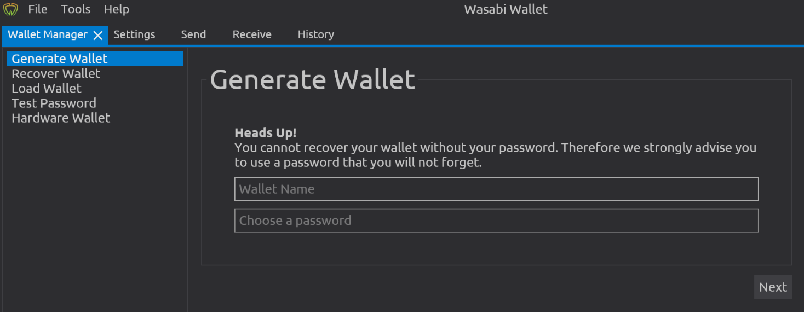

# Wallet creation - Backup

You have to create a backup and hide it and make sure you don’t store it at the same place where you keep your passphrase.

1. Click the “Generate” button**.**
2. Take your time and write them down correctly. Make sure that the words are easily readable and in the correct order.
3. Write down the number in front of each word, to make sure you know what the correct order is.&#x20;
4. <mark style="color:red;">**Triple check to make sure.**</mark>
5. <mark style="color:red;">**Triple check to make sure.**</mark>
6. <mark style="color:red;">**Triple check to make sure.**</mark>
7. Find a secure way to store it. Get creative!
   * You can do two backups and store them in different places.


If Wasabi Wallet suddenly goes out of business and they remove their application from the app stores, having your backup will allow you to still have access to your funds.


9\. Wasabi Wallet will ask you once to re-enter the password to make sure you know it.

10\. Once the backup is written down and you confirmed your password, click on “Load Wallet”.

### **You now have a Bitcoin wallet!**

