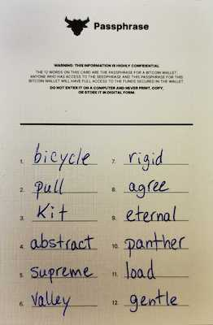

# Wallet creation - Passphrase

The next step involves choose a name and passphrase for the Bitcoin wallet. Before doing that, read below to know the passphrase security basics.

.png>)


Wasabi wallet will use the term "password", but it actually refers to you passphrase.


## **⛔️ **<mark style="color:red;">**WARNING !**</mark> <mark style="color:red;"></mark><mark style="color:red;">Take a few minutes to choose the right passphrase for your wallet. No rush! Do not skip this part!</mark>

### Passphrase Security Basics

* Write down the passphrase you want to use before entering it in your computer.
* Use English words for your passphrase.
* Use up to 12 words for maximum security.
* The passphrase is required every time you want to use the app.
* If someone has access to your computer, the passphrase will prevent them from taking your Bitcoin.
* Ideally, create a unique passphrase that nobody can guess but that you can remember.
* If you lose the passphrase, you lose access to your Bitcoin forever.
* You cannot change your passphrase. If you want to change your passphrase, you will have to start the process all over again.
* The passphrase is required to recover your access to your Bitcoin if your computer is damaged, lost or stolen.
* Pro-tip: the name of your wallet is mostly for accounting purposes and keeping track of your transactions if you have multiple wallets. The name doesn’t make any difference in the app and is not shared with anyone else.

#### **See the** [<mark style="color:red;">**passphrase best practices**</mark>](https://docs.wasabiwallet.io/using-wasabi/PasswordBestPractices.html) **if you are unsure how to create one.**

