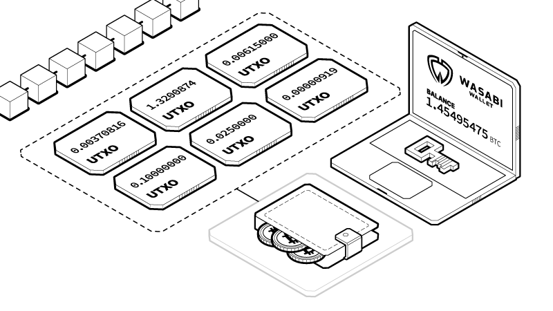

# Sending Bitcoin - Overview

### To send Bitcoin using Wasabi, all you need is the Bitcoin address of the recipient.

#### **Coin Control**

Wasabi implements a technique called Coin Control by default. When you are sending transactions, you must select the individual coins available in your wallet, also known as Unspent Transaction Outputs (UTXO), that you wish to send. You can select several at a time if the balance you wish to send exceeds the balance of any one UTXO.

Think of bitcoins as actual physical coins of different amounts in your pocket. You can combine some of those coins if the amount of a single one is insufficient. If the amount of a coin is greater than the amount needed to send, you will get change back.

#### **Labeling**

For every bitcoin transaction you send and receive, it is important to identify who is observing that transaction. The label serves the purpose of making sure that we are aware of who is sending us coins and who we are sending them to. Bitcoin transactions being public, we want to avoid as much as possible revealing our transaction history to anyone that might be keeping track of us.

So for example, if you receive bitcoin as payment for a job you completed, you can write “Bull Bitcoin pay”.

Now, if you want to send coins to someone else, you can use the same coin with the “Bull Bitcoin” label if you wish to sell them on the Bull Bitcoin platform and add the label “Bull Bitcoin sold”, since it is the same observer of that coin, ie. Bull Bitcoin. If however, you wish to purchase something and you do not want your employer to know about it, then you would use a different coin that they are not capable of observing the transaction history.
